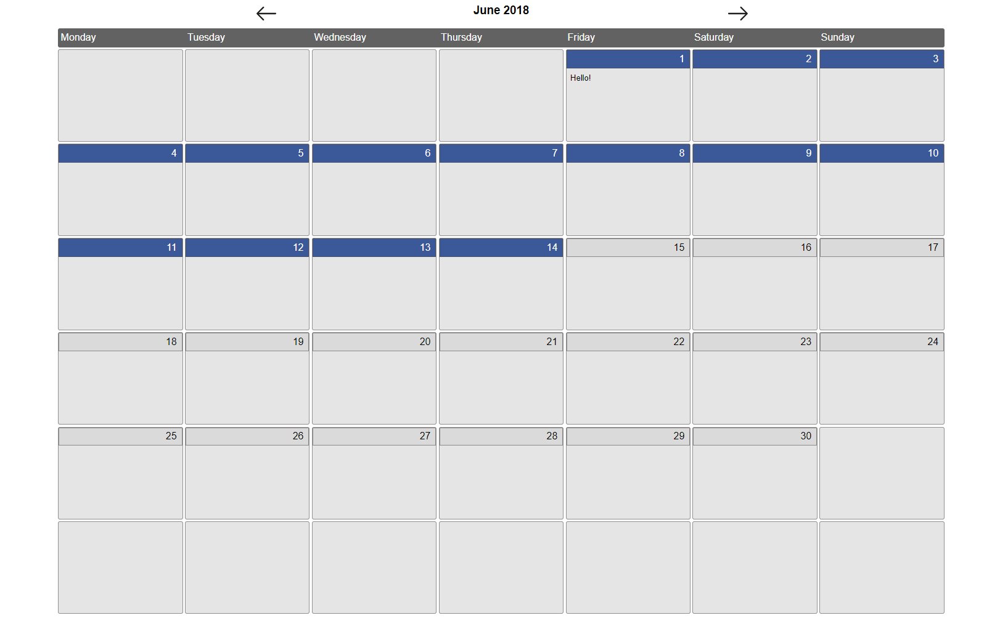

# Calendar

I've used vanilla JavaScript to create a calendar. 

---

Current features:

..* Change month with the arrows next to current month/year
..* Makes AJAX request to a local .json file that decides the colour scheme/text for each day (or group of days).

---

---

---

## Getting Started

I use the [XAMPP](https://www.apachefriends.org/index.html) stack to develop & test this project locally.

---

## Built With

JavaScript
HTML
CSS

---

## Author

**Skye Gill** - [Skyerus](https://github.com/Skyerus)